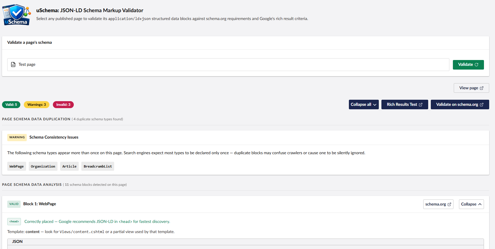
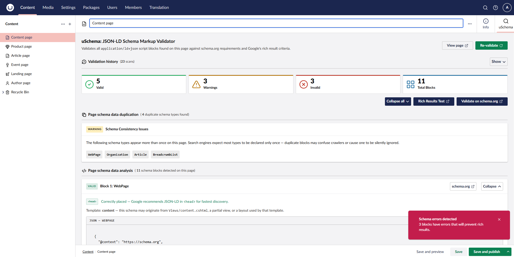

# uSchema

[](https://www.nuget.org/packages/Umbraco.Community.uSchema/)
[](https://www.nuget.org/packages/Umbraco.Community.uSchema)
[](LICENSE)

Validate the JSON-LD structured data on your published Umbraco content pages — directly inside the backoffice.

uSchema adds a **Schema** tab to every content node workspace and a **uSchema** dashboard. Both fetch the live published page, parse every `<script type="application/ld+json">` block, and validate each one against schema.org recommendations.



## Features

- **Schema workspace tab** — validates the page you're editing without leaving the content node
- **uSchema dashboard** — pick any published page by name and validate it on demand
- **At-a-glance status** — each JSON-LD block is marked Valid, Warning, or Invalid with a summary count
- **Error & warning detail** — clear descriptions of what's missing or incorrect, with direct links to schema.org and Google documentation
- **Annotated JSON examples** — colour-coded view showing exactly which properties need adding
- **Broad schema type support** — 30+ types including Article, NewsArticle, WebPage, Organization, BreadcrumbList, FAQPage, LocalBusiness, Product, Event, Recipe, Person, WebSite, VideoObject, HowTo, JobPosting, and more
- **`@graph` block support** — multi-entity JSON-LD documents are fully parsed
- **Source location indicator** — shows whether each block is in `<head>` or `<body>`
- **Duplicate type detection** — warns when the same schema type appears in multiple blocks

## Requirements

- Umbraco 17+
- .NET 10+

## Installation

```bash
dotnet add package Umbraco.Community.uSchema
```

No configuration is required. After installing and restarting your site, the **Schema** tab appears on all content nodes and the **uSchema** dashboard appears under the Content section.

## Usage

### Workspace tab

1. Open any **published** content node in the Umbraco backoffice
2. Click the **Schema** tab
3. uSchema fetches the live page and displays all JSON-LD blocks with their validation status

### Dashboard

1. Go to **Content** > **uSchema** in the left navigation
2. Use the content picker to select any published page
3. Click **Validate** to see that page's JSON-LD results

> **Note:** The page must be published for validation to work. Unpublished pages cannot be fetched.

## Screenshots




## Contributing

See [CONTRIBUTING.md](CONTRIBUTING.md) for local development setup.

## Issues

Please report bugs or feature requests at [GitHub Issues](https://github.com/Jordan-Smith-Dev/uSchema/issues).

## License

MIT — see [LICENSE](LICENSE).
