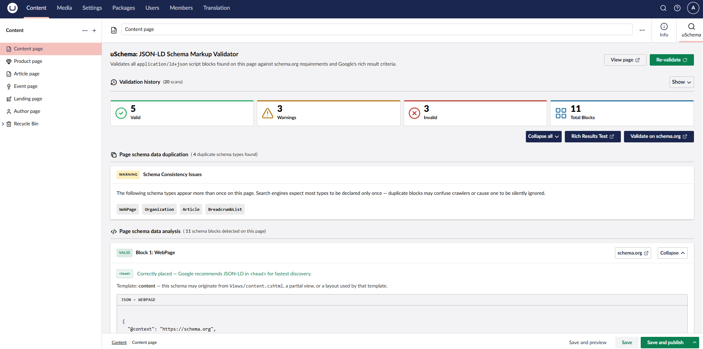
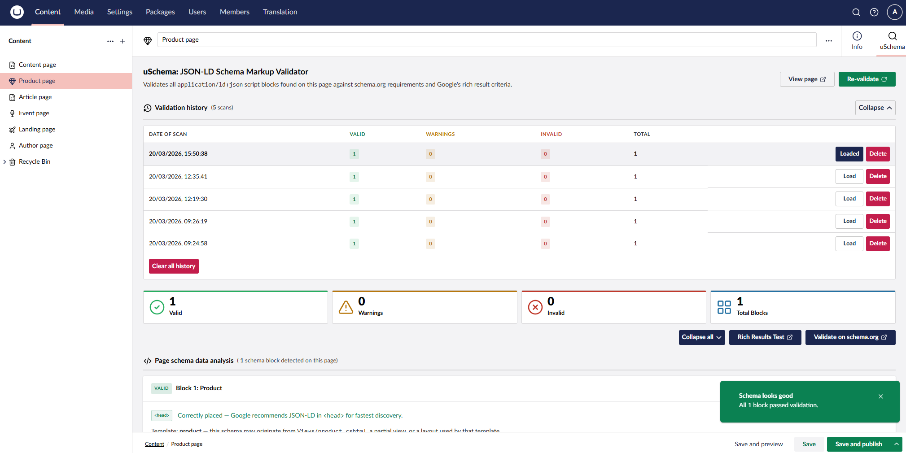
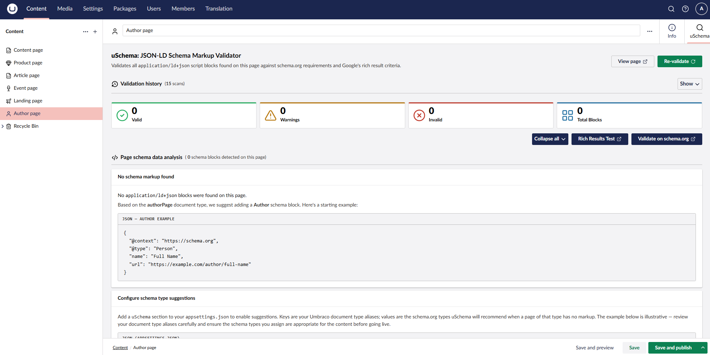

# uSchema

[](https://www.nuget.org/packages/Umbraco.Community.uSchema/)
[](https://www.nuget.org/packages/Umbraco.Community.uSchema)
[](LICENSE)
[](https://marketplace.umbraco.com/package/umbraco.community.uschema)

Validate the JSON-LD structured data on your published Umbraco content pages — directly inside the backoffice.

uSchema adds a **Schema** tab to every content node workspace and a **uSchema** dashboard. Both fetch the live published page, parse every `<script type="application/ld+json">` block, and validate each one against schema.org recommendations.


## Features

- **Schema workspace tab** — validates the page you're editing without leaving the content node
- **uSchema dashboard** — pick any published page by name and validate it on demand
- **At-a-glance status** — each JSON-LD block is marked Valid, Warning, or Invalid with a summary count
- **Error & warning detail** — clear descriptions of what's missing or incorrect, with direct links to schema.org and Google documentation
- **Annotated JSON examples** — colour-coded view showing exactly which properties need adding or correcting, with a "Suggested fix" block that addresses all flagged issues at once
- **Google Rich Results eligibility** — per-block status showing whether the block meets Google's requirements, which required fields are missing, and a direct link to Google's Rich Results documentation for that type
- **Broad schema type support** — 30+ types including Article, NewsArticle, WebPage, Organization, BreadcrumbList, FAQPage, LocalBusiness, Product, Event, Recipe, Person, WebSite, VideoObject, HowTo, JobPosting, and more
- **`@graph` block support** — multi-entity JSON-LD documents are fully parsed
- **Source location indicator** — shows whether each block is in `<head>` or `<body>`, with advice on placement and a hint suggesting the responsible Razor view based on the content type alias
- **Duplicate type detection** — warns when the same schema type appears in multiple blocks
- **Schema type suggestions** — when a page has no JSON-LD markup, uSchema can suggest an appropriate schema type based on the document type and display a ready-to-use example block; configured via `appsettings.json`
- **Validation history** — per-page history of recent scans in the workspace tab; load any previous result in full, with the most recent scan highlighted on load
- **Collapse / expand controls** — collapse all blocks at once or toggle individual ones

## What it doesn't do

- **Does not audit unpublished pages** — the page must have a published URL reachable from the server
- **Does not run scheduled or background scans** — validation is on-demand only, triggered from the workspace tab or dashboard
- **Does not fix issues** — it identifies and explains problems; remediation is done by your developers
- **Does not guarantee schema.org compliance** — automated validation covers required and recommended properties for known types; bespoke or unusual schema usage may not be fully evaluated
- **Does not validate authenticated pages** — pages behind a login or bot-protection cannot be fetched

## Requirements

- Umbraco 17+
- .NET 10+

## Installation

```bash
dotnet add package Umbraco.Community.uSchema
```

No configuration is required. After installing and restarting your site, the **Schema** tab appears on all content nodes and the **uSchema** dashboard appears under the Content section.

## Usage

### Workspace tab

1. Open any **published** content node in the Umbraco backoffice
2. Click the **Schema** tab
3. uSchema fetches the live page and displays all JSON-LD blocks with their validation status

### Dashboard

1. Go to **Content** > **uSchema** in the left navigation
2. Use the content picker to select any published page
3. Click **Validate** to see that page's JSON-LD results

> **Note:** The page must be published for validation to work. Unpublished pages cannot be fetched.

## Configuration

### Schema type suggestions (optional)

To enable schema type suggestions for pages with no JSON-LD markup, add a `uSchema` section to your `appsettings.json`:

```json
"uSchema": {
  "DocumentTypeSchemaMap": {
    "blogPost": "Article",
    "product": "Product",
    "eventPage": "Event",
    "landingPage": "WebPage"
  }
}
```

Keys are your Umbraco document type aliases; values are the schema.org types uSchema will suggest when a page of that type has no markup. When a match is found, uSchema displays a ready-to-use example block alongside setup instructions.

## Screenshots








## Contributing

See [CONTRIBUTING.md](CONTRIBUTING.md) for local development setup.

## Issues

Please report bugs or feature requests at [GitHub Issues](https://github.com/Jordan-Smith-Dev/uSchema/issues).

## License

MIT — see [LICENSE](LICENSE).
